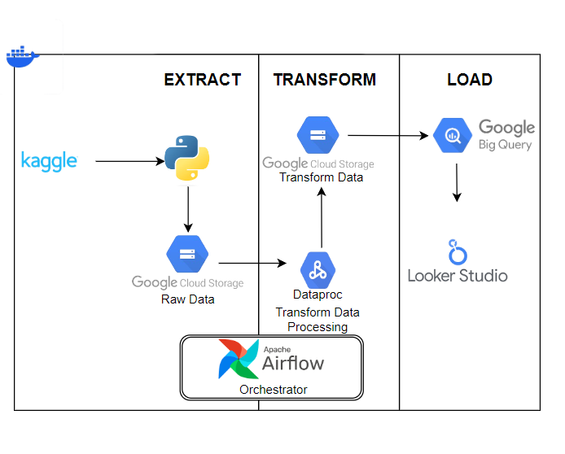

# Sephora E-Commerce Review Analysis

This project utilizes Sephora product and skincare review data from Kaggle (https://www.kaggle.com/datasets/nadyinky/sephora-products-and-skincare-reviews) to build a data pipeline for data transformation, modeling, and warehousing. 

## Project Overview
This project outlines a data pipeline for an E-commerce company to extract, transform, and load (ETL) data to gain actionable insights for better decision-making about user preferences and satisfaction.

### Objective:
-  Product Performance Analysis
-  Review Customer Analysis
-  Visualize the distribution

### Exoected Output:
- Robust Data Pipeline
- Dashboard from Product and Review analysis
- Getting some insight

## Data Structure
### Product Data Content

`product_id`:	The unique identifier for the product from the site

`product_name`:	The full name of the product

`brand_id`:	The unique identifier for the product brand: from the site

`brand_name`:	The full name of the product brand

`loves_count`:	The number of people who have marked this product as a favorite

`rating`:	The average rating of the product based on user reviews

`reviews`:	The number of user reviews for the product

`size`:	The size of the product, which may be in oz, ml, g, 

`packs`:, or other units depending on the product type

`variation_type`: 	The type of variation parameter for the product  (e.g. Size, Color)

`variation_value`: 	The specific value of the variation parameter for the product (e.g. 100 mL, Golden Sand)

`variation_desc`:	A description of the variation parameter for the product (e.g. tone for fairest skin)

`ingredients`	A list of ingredients included in the product, for example: [‘Product variation 1:’, ‘Water, Glycerin’, ‘Product variation 2:’, ‘Talc, Mica’] or if no variations [‘Water, Glycerin’]

`price_usd`:	The price of the product in US dollars

`value_price_usd`: 	The potential cost savings of the product, presented on the site next to the regular price

`sale_price_usd`: 	The sale price of the product in US dollars

`limited_edition`:	Indicates whether the product is a limited edition or not (1-true, 0-false)
new	Indicates whether the product is new or not (1-true, 0-false)
online_only	Indicates whether the product is only sold online or not (1-true, 0-false)

`out_of_stock`:	Indicates whether the product is currently out of stock or not (1 if true, 0 if false)

`sephora_exclusive`:	Indicates whether the product is exclusive to Sephora or not (1 if true, 0 if false)

`highlights`:	A list of tags or features that highlight the product's attributes (e.g. [‘Vegan’, ‘Matte Finish’])

`primary_category`:	First category in the breadcrumb section

`secondary_category`:	Second category in the breadcrumb section

`tertiary_category`:	Third category in the breadcrumb section

`child_max_price`:	The number of variations of the product available
child_max_price	The highest price among the variations of the product
child_min_price	The lowest price among the variations of the product

### Review content

`author_id`:	The unique identifier for the author of the review on the website
rating	The rating given by the author for the product on a scale of 1 to 5

`is_recommended`:	Indicates if the author recommends the product or not (1-true, 0-false)

`helpfulness`:	The ratio of all 

`ratings` to positive ratings for the review: 

`helpfulness`:  = total_pos_feedback_count / total_feedback_count

`total_feedback_count`: 	Total number of feedback (positive and negative ratings) left by users for the review

`total_neg_feedback_count`:	The number of users who gave a negative rating for the review

`total_pos_feedback`: _count	The number of users who gave a positive rating for the review

`submission_time`:	Date the review was posted on the website in the 'yyyy-mm-dd' format

`review_text`:	The main text of the review written by the author

`review_title`: 	The title of the review written by the author

`skin_tone`: 	Author's skin tone (e.g. fair, tan, etc.)

`eye_color`:	Author's eye color (e.g. brown, green, etc.)

`skin_type`: 	Author's skin type (e.g. combination, oily, etc.)

`hair_color`: 	Author's hair color (e.g. brown, auburn, etc.)

`product_id`: 	The unique identifier for the product on the website
### Technology Used
- Data engineering workflows using Airflow.
- Data wrangling and transformation techniques with PySpark.
- Data modeling concepts like star schema design.
- Utilizing cloud-based data warehousing platforms (BigQuery).

- Get Data from kaggle
- Save the raw data into parquet
- Clean and transform the data into defined schema
- Load it into BigQuery Data Warehouse
- Get Actionable Insight from Looker Studio
